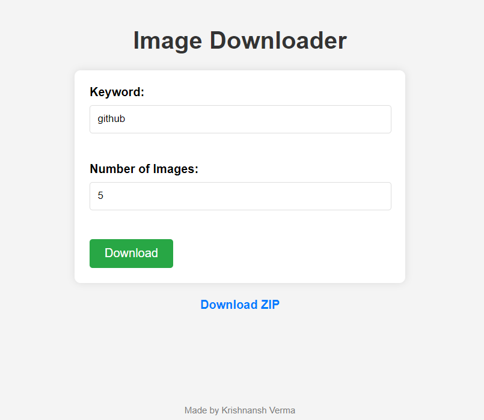

# Image Dataset Downloader
 This project is a Python-based web application made using Bing API that allows users to download a specified number of images based on a keyword search. Using the search engine, it fetches relevant images and provides them in a downloadable ZIP format. The web interface is user-friendly, where users can input a search keyword and the desired number of images, and the server responds by fetching the images and generating a downloadable ZIP file.
 ### Features

- Search for images based on a keyword.
- Specify the number of images to download.
- Automatically fetch images.
- Download the images in a ZIP file format.
### Interface

